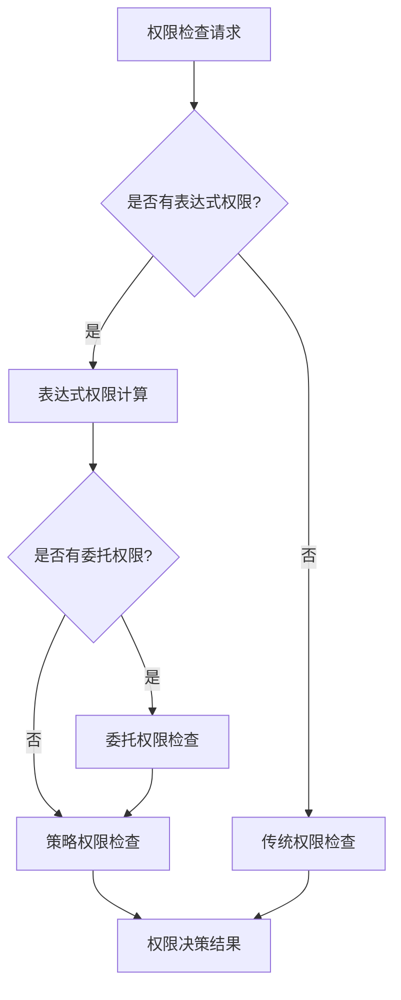

# 权限管理改进方案实际落地实施计划

## 一、实施总览

### 1.1 实施周期
- **总工期**: 6周
- **参与人员**: 3-4名开发人员
- **实施方式**: 分阶段渐进式实施

### 1.2 技术栈
- **后端**: Spring Boot 3.2+ + Spring Security + MyBatis-Plus
- **缓存**: Redis 6.0+
- **数据库**: MySQL 8.0+
- **表达式引擎**: Spring Expression Language (SpEL)

## 二、分阶段实施计划

### 阶段1：表达式权限引擎 (第1-2周)

#### 1.1 核心组件开发
✅ **已完成**:
- `PermissionExpressionEngine` - 表达式引擎核心
- `PermissionExpression` - 权限表达式实体
- `EnhancedPermissionChecker` - 增强权限检查器

#### 1.2 待完成任务
- [ ] 权限表达式数据库表创建
- [ ] 权限表达式Repository和Service层
- [ ] 表达式权限缓存机制
- [ ] 权限表达式管理界面

#### 1.3 数据库表结构
```sql
-- 权限表达式表
CREATE TABLE sys_permission_expression (
    id BIGINT PRIMARY KEY AUTO_INCREMENT,
    permission_id BIGINT NOT NULL COMMENT '权限ID',
    expression_name VARCHAR(100) NOT NULL COMMENT '表达式名称',
    expression_content TEXT NOT NULL COMMENT '表达式内容',
    expression_type VARCHAR(50) NOT NULL DEFAULT 'spel' COMMENT '表达式类型',
    variables JSON COMMENT '变量定义',
    description VARCHAR(500) COMMENT '描述',
    status TINYINT DEFAULT 1 COMMENT '状态：1-启用，0-禁用',
    tenant_id BIGINT COMMENT '租户ID',
    creator VARCHAR(64) DEFAULT '' COMMENT '创建者',
    create_time DATETIME DEFAULT CURRENT_TIMESTAMP COMMENT '创建时间',
    updater VARCHAR(64) DEFAULT '' COMMENT '更新者',
    update_time DATETIME DEFAULT CURRENT_TIMESTAMP ON UPDATE CURRENT_TIMESTAMP COMMENT '更新时间',
    deleted TINYINT DEFAULT 0 COMMENT '是否删除',
    INDEX idx_permission_id (permission_id),
    INDEX idx_tenant_id (tenant_id)
);
```

### 阶段2：权限委托机制 (第3周)

#### 2.1 核心组件开发
✅ **已完成**:
- `PermissionDelegation` - 权限委托实体
- `PermissionDelegationService` - 权限委托服务

#### 2.2 待完成任务
- [ ] 权限委托数据库表创建
- [ ] 权限委托Repository层
- [ ] 权限委托Controller和管理界面
- [ ] 委托权限自动过期机制
- [ ] 委托权限审计日志

#### 2.3 数据库表结构
```sql
-- 权限委托表
CREATE TABLE sys_permission_delegation (
    id BIGINT PRIMARY KEY AUTO_INCREMENT,
    delegator_id BIGINT NOT NULL COMMENT '委托人ID',
    delegatee_id BIGINT NOT NULL COMMENT '被委托人ID',
    permission_ids JSON NOT NULL COMMENT '委托权限ID列表',
    delegation_type VARCHAR(50) NOT NULL COMMENT '委托类型：temporary,permanent',
    start_time DATETIME NOT NULL COMMENT '开始时间',
    end_time DATETIME COMMENT '结束时间',
    reason VARCHAR(500) COMMENT '委托原因',
    status VARCHAR(20) DEFAULT 'active' COMMENT '状态：active,revoked,expired',
    tenant_id BIGINT COMMENT '租户ID',
    creator VARCHAR(64) DEFAULT '' COMMENT '创建者',
    create_time DATETIME DEFAULT CURRENT_TIMESTAMP COMMENT '创建时间',
    updater VARCHAR(64) DEFAULT '' COMMENT '更新者',
    update_time DATETIME DEFAULT CURRENT_TIMESTAMP ON UPDATE CURRENT_TIMESTAMP COMMENT '更新时间',
    deleted TINYINT DEFAULT 0 COMMENT '是否删除',
    INDEX idx_delegator_id (delegator_id),
    INDEX idx_delegatee_id (delegatee_id),
    INDEX idx_status (status),
    INDEX idx_end_time (end_time)
);
```

### 阶段3：权限策略引擎 (第4周)

#### 3.1 核心组件
- [ ] `PermissionStrategy` - 权限策略实体
- [ ] `PermissionStrategyEngine` - 策略引擎
- [ ] `PermissionDecisionEngine` - 权限决策引擎

#### 3.2 策略类型支持
- **时间策略**: 基于时间范围的权限控制
- **条件策略**: 基于业务条件的权限判断
- **审批策略**: 需要审批的权限申请

### 阶段4：增强按钮权限 (第5周)

#### 4.1 核心组件
- [ ] `ButtonPermissionExpression` - 按钮权限表达式
- [ ] `DynamicButtonPermissionChecker` - 动态按钮权限检查
- [ ] 前端按钮权限指令增强

#### 4.2 功能特性
- 条件式按钮显示/隐藏
- 数据范围与按钮权限结合
- 按钮权限的实时计算

### 阶段5：系统集成与优化 (第6周)

#### 5.1 系统集成
- [ ] 权限缓存优化
- [ ] 性能监控和调优
- [ ] 权限管理界面完善
- [ ] 权限审计报表

#### 5.2 测试与部署
- [ ] 单元测试覆盖
- [ ] 集成测试
- [ ] 性能测试
- [ ] 生产环境部署

## 三、关键实现细节

### 3.1 权限表达式示例

#### 部门数据权限
```spel
#currentUser.deptId == #target.deptId
```

#### 层级权限控制
```spel
#currentUser.level >= #target.level && #currentUser.deptId == #target.deptId
```

#### 时间范围权限
```spel
#now >= #startTime && #now <= #endTime
```

#### 复合条件权限
```spel
(#currentUser.roleCode == 'admin' || #currentUser.deptId == #target.deptId) && #target.status == 'active'
```

### 3.2 缓存策略

#### 多级缓存架构
```java
@Component
public class HierarchicalPermissionCache {
    
    // L1缓存：本地缓存，毫秒级响应
    private final Cache<String, UserPermissionDTO> localCache = 
        Caffeine.newBuilder()
            .maximumSize(1000)
            .expireAfterWrite(5, TimeUnit.MINUTES)
            .build();
    
    // L2缓存：Redis缓存，10ms级响应
    @Cacheable(value = "user_permissions", key = "#userId")
    public UserPermissionDTO getUserPermissions(Long userId) {
        return localCache.get(userId.toString(), 
            key -> loadFromRedisOrDatabase(userId));
    }
}
```

### 3.3 权限决策流程



## 四、风险控制措施

### 4.1 技术风险
- **表达式性能**: 实现表达式编译缓存，避免重复解析
- **缓存一致性**: 使用Redis发布订阅机制同步缓存更新
- **安全风险**: 表达式白名单机制，防止恶意表达式

### 4.2 业务风险
- **权限配置错误**: 提供表达式验证和测试工具
- **权限过度委托**: 实现委托权限的审批和监控机制
- **系统兼容性**: 保持向后兼容，支持渐进式迁移

## 五、成功验收标准

### 5.1 功能验收
- [ ] 表达式权限正确执行，支持复杂业务逻辑
- [ ] 权限委托机制完整，支持临时和永久委托
- [ ] 按钮权限动态控制，支持条件式显示
- [ ] 权限管理界面友好，支持可视化配置

### 5.2 性能验收
- [ ] 权限检查响应时间 < 10ms
- [ ] 支持1000+并发用户
- [ ] 缓存命中率 > 90%
- [ ] 数据库查询减少 > 80%

### 5.3 安全验收
- [ ] 权限表达式安全检查通过
- [ ] 权限委托审计完整
- [ ] 无权限绕过漏洞
- [ ] 权限配置错误率 < 1%

## 六、后续优化方向

### 6.1 智能化增强
- 基于机器学习的权限推荐
- 权限使用模式分析
- 异常权限行为检测

### 6.2 可视化增强
- 权限关系图谱
- 权限使用热力图
- 权限审计仪表板

### 6.3 集成扩展
- 与工作流引擎集成
- 与审计系统集成
- 与监控告警系统集成

这个实施计划提供了完整的落地路径，确保权限管理改进方案能够稳步推进并成功实施。