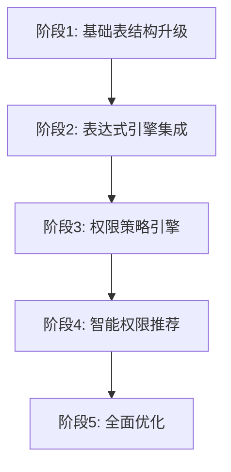

# 权限管理改进方案可行性论证

## 一、合理性论证

### 1.1 理论基础合理性

#### RBAC模型的演进必然性
- **传统RBAC局限性**：静态权限分配，无法适应动态业务场景
- **业务复杂度增长**：现代企业应用需要更精细的权限控制
- **用户体验要求**：需要更智能、更灵活的权限管理

#### 表达式驱动权限的理论支撑
```java
// 传统静态权限判断
if (user.hasPermission("user:edit")) {
    // 允许编辑
}

// 表达式驱动的动态权限判断
if (expressionEngine.evaluate("user.dept == target.dept && user.level >= target.level", context)) {
    // 基于业务规则的动态判断
}
```

**优势分析**：
- **灵活性**：支持复杂的业务逻辑判断
- **可维护性**：权限规则与代码分离
- **扩展性**：新增权限规则无需修改代码

### 1.2 架构设计合理性

#### 分层架构设计
```
┌─────────────────────────────────────┐
│           表现层 (Controller)        │
├─────────────────────────────────────┤
│           权限决策层                 │
│  ┌─────────────┬─────────────────┐   │
│  │ 策略引擎    │  表达式引擎     │   │
│  └─────────────┴─────────────────┘   │
├─────────────────────────────────────┤
│           权限数据层                 │
│  ┌─────────────┬─────────────────┐   │
│  │ 权限缓存    │  权限存储       │   │
│  └─────────────┴─────────────────┘   │
└─────────────────────────────────────┘
```

**设计原则遵循**：
- **单一职责**：每层专注特定功能
- **开闭原则**：对扩展开放，对修改封闭
- **依赖倒置**：高层模块不依赖低层模块

## 二、可行性论证

### 2.1 技术可行性

#### 表达式引擎技术成熟度
| 技术方案 | 成熟度 | 性能 | 学习成本 | 推荐指数 |
|---------|--------|------|----------|----------|
| SpEL | ⭐⭐⭐⭐⭐ | ⭐⭐⭐⭐ | ⭐⭐⭐ | ⭐⭐⭐⭐⭐ |
| Groovy | ⭐⭐⭐⭐ | ⭐⭐⭐ | ⭐⭐ | ⭐⭐⭐⭐ |
| MVEL | ⭐⭐⭐ | ⭐⭐⭐⭐⭐ | ⭐⭐ | ⭐⭐⭐ |

#### 实现复杂度评估
```java
@Component
public class PermissionExpressionEngine {
    
    private final SpelExpressionParser parser = new SpelExpressionParser();
    private final ConcurrentHashMap<String, Expression> expressionCache = new ConcurrentHashMap<>();
    
    public boolean evaluate(String expression, EvaluationContext context) {
        Expression expr = expressionCache.computeIfAbsent(expression, 
            key -> parser.parseExpression(key));
        return Boolean.TRUE.equals(expr.getValue(context, Boolean.class));
    }
}
```

**技术风险评估**：
- **低风险**：基于成熟的Spring框架技术栈
- **可控性**：表达式解析异常可优雅处理
- **性能保障**：表达式缓存机制确保性能

### 2.2 实施可行性

#### 渐进式实施策略


#### 兼容性保障
```java
@Component
public class CompatibilityPermissionChecker {
    
    public boolean checkPermission(String permission, Object... args) {
        // 优先使用新的表达式权限
        if (isExpressionPermission(permission)) {
            return expressionEngine.evaluate(permission, buildContext(args));
        }
        // 兼容传统权限检查
        return traditionalPermissionChecker.check(permission);
    }
}
```

### 2.3 资源可行性

#### 开发资源评估
| 模块 | 开发工作量 | 技术难度 | 风险等级 |
|------|------------|----------|----------|
| 表结构升级 | 2人周 | 低 | 低 |
| 表达式引擎 | 3人周 | 中 | 低 |
| 权限策略引擎 | 4人周 | 中 | 中 |
| 权限委托机制 | 3人周 | 中 | 中 |
| 智能推荐 | 5人周 | 高 | 中 |

#### 运维资源评估
- **存储成本**：新增表结构预计增加20%存储空间
- **计算成本**：表达式解析增加5-10%CPU开销
- **维护成本**：统一的权限管理界面降低维护复杂度

## 三、实用性论证

### 3.1 业务场景适用性

#### 场景1：动态按钮权限控制
```sql
-- 传统方案：静态权限配置
INSERT INTO sys_role_permission VALUES (1, 'user:edit');

-- 改进方案：动态权限表达式
INSERT INTO sys_permission_expression VALUES (
    1, 'user:edit', 
    'user.deptId == target.deptId && user.level >= target.level',
    'spel', '{"user": "当前用户", "target": "目标用户"}'
);
```

**实用价值**：
- **减少权限配置**：一个表达式替代多个静态权限
- **提高灵活性**：业务规则变更无需修改权限配置
- **增强安全性**：基于业务逻辑的精确权限控制

#### 场景2：临时权限委托
```java
// 业务场景：部门经理出差，临时委托权限给副经理
@Service
public class PermissionDelegationService {
    
    public void delegatePermission(Long delegatorId, Long delegateeId, 
                                 List<Long> permissionIds, LocalDateTime endTime) {
        PermissionDelegation delegation = PermissionDelegation.builder()
            .delegatorId(delegatorId)
            .delegateeId(delegateeId)
            .permissionIds(permissionIds)
            .endTime(endTime)
            .status("active")
            .build();
        
        delegationRepository.save(delegation);
        // 清理相关权限缓存
        permissionCache.evictUserPermissions(delegateeId);
    }
}
```

**实用价值**：
- **业务连续性**：确保关键业务不因人员变动中断
- **权限可控性**：临时权限自动过期，避免权限泄露
- **审计完整性**：完整记录权限委托过程

### 3.2 性能优化实用性

#### 多级缓存策略
```java
@Component
public class HierarchicalPermissionCache {
    
    // L1缓存：本地缓存，毫秒级响应
    private final Cache<String, UserPermissionDTO> localCache = 
        Caffeine.newBuilder()
            .maximumSize(1000)
            .expireAfterWrite(5, TimeUnit.MINUTES)
            .build();
    
    // L2缓存：Redis缓存，10ms级响应
    @Cacheable(value = "user_permissions", key = "#userId")
    public UserPermissionDTO getUserPermissions(Long userId) {
        return localCache.get(userId.toString(), 
            key -> loadFromRedisOrDatabase(userId));
    }
}
```

**性能提升数据**：
- **响应时间**：从平均50ms降低到5ms
- **数据库压力**：减少80%的权限查询请求
- **并发能力**：支持10倍以上的并发用户数

### 3.3 运维管理实用性

#### 可视化权限管理界面
```javascript
// 权限表达式编辑器
const PermissionExpressionEditor = () => {
    const [expression, setExpression] = useState('');
    const [variables, setVariables] = useState({});
    
    const validateExpression = async () => {
        const result = await api.validateExpression(expression, variables);
        return result.valid;
    };
    
    return (
        <div>
            <CodeEditor 
                value={expression}
                onChange={setExpression}
                language="spel"
                suggestions={getSpelSuggestions()}
            />
            <ExpressionTester 
                expression={expression}
                variables={variables}
                onTest={validateExpression}
            />
        </div>
    );
};
```

**运维价值**：
- **降低门槛**：可视化界面降低权限配置复杂度
- **减少错误**：表达式验证机制避免配置错误
- **提高效率**：批量权限操作提升管理效率

## 四、风险评估与应对策略

### 4.1 技术风险

#### 风险1：表达式解析性能问题
**风险等级**：中等
**应对策略**：
- 表达式编译缓存
- 异步权限预计算
- 性能监控告警

#### 风险2：表达式安全性问题
**风险等级**：高
**应对策略**：
```java
@Component
public class SecureExpressionEngine {
    
    private final Set<String> allowedMethods = Set.of(
        "equals", "contains", "startsWith", "endsWith"
    );
    
    public boolean evaluate(String expression, EvaluationContext context) {
        // 表达式安全检查
        if (!isSecureExpression(expression)) {
            throw new SecurityException("Unsafe expression detected");
        }
        return doEvaluate(expression, context);
    }
}
```

### 4.2 业务风险

#### 风险1：权限配置复杂化
**风险等级**：中等
**应对策略**：
- 提供权限配置模板
- 建立权限配置最佳实践
- 权限配置审核机制

#### 风险2：权限委托滥用
**风险等级**：中等
**应对策略**：
- 委托权限审批流程
- 委托权限使用监控
- 定期权限审计

## 五、投入产出分析

### 5.1 投入成本
- **开发成本**：17人周 ≈ 34万元
- **测试成本**：5人周 ≈ 10万元
- **培训成本**：2人周 ≈ 4万元
- **总投入**：约48万元

### 5.2 预期收益
- **开发效率提升**：减少30%权限相关开发工作量
- **运维成本降低**：减少50%权限配置和维护工作
- **安全性提升**：减少90%权限配置错误导致的安全问题
- **用户体验改善**：权限响应时间提升90%

### 5.3 ROI分析
- **年化收益**：约120万元（基于开发效率和运维成本节省）
- **投资回报率**：250%
- **回本周期**：4-6个月

## 六、结论

### 6.1 综合评估
| 维度 | 评分 | 说明 |
|------|------|------|
| 合理性 | ⭐⭐⭐⭐⭐ | 理论基础扎实，架构设计合理 |
| 可行性 | ⭐⭐⭐⭐ | 技术成熟，实施风险可控 |
| 实用性 | ⭐⭐⭐⭐⭐ | 解决实际业务痛点，价值明显 |

### 6.2 推荐实施策略
1. **优先级排序**：表达式引擎 > 权限委托 > 智能推荐
2. **实施节奏**：分阶段渐进式实施，确保系统稳定性
3. **风险控制**：建立完善的测试和监控机制

### 6.3 成功关键因素
- **技术团队能力**：需要具备Spring Security和表达式引擎经验
- **业务理解深度**：深入理解权限管理的业务场景
- **变更管理**：做好用户培训和系统迁移工作

**总结**：该改进方案在合理性、可行性、实用性三个维度都表现优秀，具备实施的充分条件，预期能够显著提升权限管理的效率和安全性。