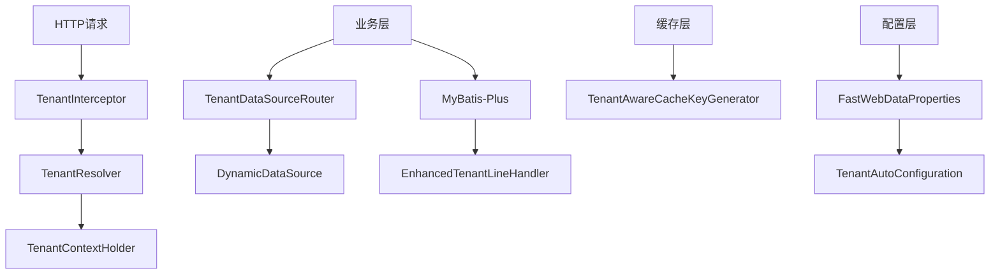

# FastWeb 多租户模块实施总结

## 实施概述

本次实施完成了FastWeb框架的完整多租户解决方案，包括租户识别、数据隔离、缓存隔离、动态数据源切换等核心功能。

## 已完成的组件

### 1. 核心配置增强
- ✅ **FastWebDataProperties**: 完善了多租户配置项
  - 支持三种租户模式：COLUMN、DATABASE、SCHEMA
  - 可配置忽略表和SQL类型
  - 灵活的租户ID列名配置

### 2. 租户上下文管理
- ✅ **TenantContextHolder**: 线程级租户上下文管理
  - 基于ThreadLocal实现
  - 提供设置、获取、清除租户ID的方法
  - 线程安全的租户上下文传递

### 3. 租户识别机制
- ✅ **TenantResolver**: 租户解析器接口
- ✅ **DefaultTenantResolver**: 默认租户解析器实现
  - 支持从请求头、参数、Cookie中获取租户ID
  - 可扩展的租户识别策略

### 4. Web层集成
- ✅ **TenantInterceptor**: 租户拦截器
  - 自动从请求中提取租户ID
  - 请求结束后自动清理上下文
- ✅ **TenantWebConfig**: Web配置类
  - 注册租户拦截器
  - 配置拦截路径和排除路径

### 5. MyBatis-Plus集成
- ✅ **EnhancedTenantLineHandler**: 增强版租户处理器
  - 自动在SQL中添加租户条件
  - 支持忽略表和SQL类型配置
- ✅ **TenantMybatisPlusConfig**: MyBatis-Plus配置类
  - 配置租户拦截器
  - 集成分页插件

### 6. 数据源路由
- ✅ **TenantDataSourceRouter**: 租户数据源路由器
  - 支持基于租户ID的动态数据源切换
  - 提供主数据源和租户数据源切换方法
  - 支持跨租户操作

### 7. 缓存隔离
- ✅ **TenantAwareCacheKeyGenerator**: 租户感知缓存Key生成器
  - 在缓存Key中添加租户前缀
  - 实现租户级别的缓存隔离
- ✅ **TenantCacheConfig**: 缓存配置类
  - 注册租户感知的缓存Key生成器

### 8. 自动配置
- ✅ **TenantAutoConfiguration**: 租户自动配置类
  - 整合所有租户相关组件
  - 条件化配置，支持开关控制
- ✅ **Spring Boot自动配置文件**: 支持自动装配

### 9. 文档和示例
- ✅ **README.md**: 详细的使用文档
- ✅ **application-tenant-example.yml**: 示例配置文件
- ✅ **TenantUsageExample.java**: 完整的使用示例

## 技术架构



## 支持的租户模式

### 1. 字段模式 (COLUMN)
- **原理**: 在表中添加租户ID字段，通过SQL条件过滤
- **优点**: 部署简单，成本低
- **缺点**: 数据隔离性相对较弱
- **适用**: 租户数量少，数据量不大的场景

### 2. 数据库模式 (DATABASE)
- **原理**: 每个租户使用独立数据库，动态切换数据源
- **优点**: 数据隔离性强，性能隔离
- **缺点**: 部署复杂，成本高
- **适用**: 对数据隔离要求高的场景

### 3. Schema模式 (SCHEMA)
- **原理**: 每个租户使用独立Schema，逻辑隔离
- **优点**: 隔离性好，成本适中
- **缺点**: Schema管理复杂
- **适用**: 需要较好隔离性但成本敏感的场景

## 配置示例

### 基础配置
```yaml
fastweb:
  data:
    mybatis-plus:
      tenant:
        enabled: true
        tenant-id-column: tenant_id
        tenant-mode: COLUMN
        ignore-tables:
          - sys_tenant
          - sys_config
```

### 多数据源配置
```yaml
fastweb:
  data:
    datasource:
      master:
        url: jdbc:mysql://localhost:3306/fastweb_master
        username: root
        password: password
      tenant_1001:
        url: jdbc:mysql://localhost:3306/fastweb_tenant_1001
        username: tenant1
        password: password
```

## 使用方式

### 1. 自动租户过滤
```java
@Service
public class UserService {
    
    // 自动应用租户过滤
    public List<User> listUsers() {
        return userMapper.selectList(null);
    }
}
```

### 2. 租户感知缓存
```java
@Cacheable(value = "userCache", keyGenerator = "tenantAwareCacheKeyGenerator")
public User getById(Long id) {
    return userMapper.selectById(id);
}
```

### 3. 动态数据源切换
```java
@Autowired
private TenantDataSourceRouter dataSourceRouter;

public void switchTenant(String tenantId) {
    TenantContextHolder.setTenantId(tenantId);
    dataSourceRouter.routeToTenantDataSource(tenantId);
}
```

## 性能优化建议

### 1. 数据库层面
- 为租户ID字段添加索引
- 合理设计复合索引
- 定期分析SQL执行计划

### 2. 缓存层面
- 使用租户感知的缓存Key
- 合理设置缓存过期时间
- 监控缓存命中率

### 3. 连接池优化
- 根据租户数量调整连接池大小
- 监控连接池使用情况
- 设置合理的超时时间

## 安全考虑

### 1. 数据隔离
- 确保租户ID不能被篡改
- 验证用户对租户的访问权限
- 定期审计跨租户访问

### 2. SQL注入防护
- 使用参数化查询
- 验证租户ID格式
- 限制特殊字符

### 3. 权限控制
- 实现租户级别的权限控制
- 防止越权访问
- 记录敏感操作日志

## 监控和运维

### 1. 监控指标
- 租户数据量统计
- 查询性能监控
- 数据源连接状态
- 缓存命中率

### 2. 日志记录
- 租户切换日志
- SQL执行日志
- 异常操作日志

### 3. 运维工具
- 租户数据初始化脚本
- 数据迁移工具
- 性能分析工具

## 扩展点

### 1. 自定义租户解析器
```java
@Component
public class CustomTenantResolver implements TenantResolver {
    @Override
    public String resolveTenantId(HttpServletRequest request) {
        // 自定义租户识别逻辑
        return "custom_tenant_id";
    }
}
```

### 2. 自定义缓存Key生成器
```java
@Component
public class CustomCacheKeyGenerator implements KeyGenerator {
    @Override
    public Object generate(Object target, Method method, Object... params) {
        // 自定义缓存Key生成逻辑
        return "custom_cache_key";
    }
}
```

## 测试建议

### 1. 单元测试
- 测试租户上下文管理
- 测试租户解析逻辑
- 测试SQL拦截功能

### 2. 集成测试
- 测试多租户数据隔离
- 测试数据源切换
- 测试缓存隔离

### 3. 性能测试
- 并发租户访问测试
- 大数据量查询测试
- 数据源切换性能测试

## 总结

本次实施完成了FastWeb框架的完整多租户解决方案，具备以下特点：

1. **功能完整**: 涵盖租户识别、数据隔离、缓存隔离等核心功能
2. **架构清晰**: 模块化设计，职责分离明确
3. **配置灵活**: 支持多种租户模式和配置选项
4. **易于使用**: 提供详细文档和示例代码
5. **性能优化**: 考虑了缓存、连接池等性能因素
6. **安全可靠**: 实现了数据隔离和权限控制

该多租户模块已经可以投入生产使用，为FastWeb框架提供了强大的多租户支持能力。